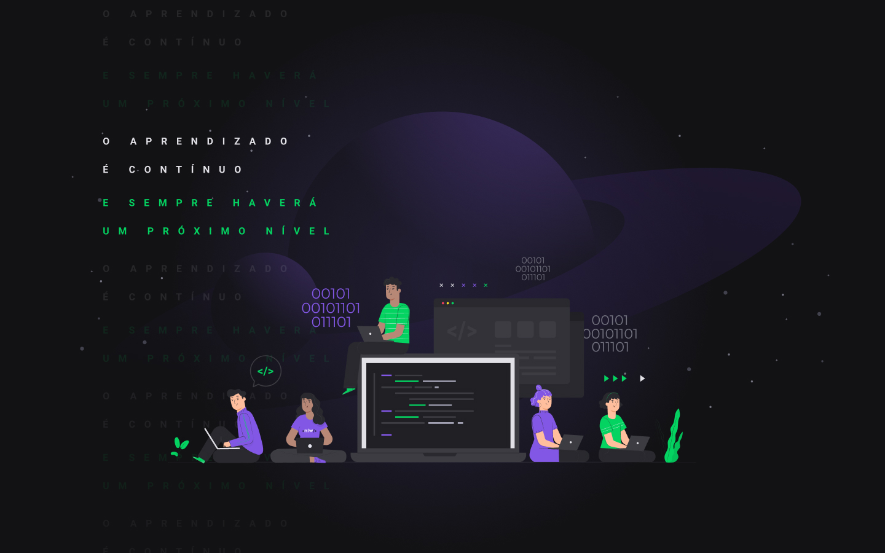

# 🎎 Happy - Faça uma visita a um orfanato

Esse projeto foi desenvolvido na semana next level da rockseat, onde tive a felicidade de aprender novos conhecimentos nos quesitos que mais desejei.

# 🔎 Sobre Happy

Trata-se de uma aplicação web, que disponibiliza por meio do mapa a localizações e disponibilidade de orfanatos próximos.

# ⚔ Tecnologias

O projeto fez uso das seguintes tecnlogias:

- [React JS](https://pt-br.reactjs.org/)
- [Node.js](https://nodejs.org/en/)
- [JavaScript](https://www.javascript.com/)
- [TypeORM](https://typeorm.io/#/)
- [SQLITE](https://www.sqlite.org/index.html)

# Pré-requisitos

Antes de começar, você vai precisar ter instalado em sua máquina as seguintes ferramentas:
[Git](https://git-scm.com), [Node.js](https://nodejs.org/en/), [React](https://pt-br.reactjs.org/).

# 🖥️ Rodando aplicação web

 Para rodar aplicação web, siga os seguintes passos: 

### Clone o repositorio

\$ git clone <https://github.com/Kujikeo/nlw3-web-backend.git>

### Acesse via terminal/cmd a pasta "web"

\$ cd web

### Instale as dependências

\$ yarn install

### Execute o projeto

\$ yarn start

# 💻 Rodando aplicação backend

 Para rodar aplicação backend, siga os seguintes passos: 

### Clone o repositorio

\$ git clone <https://github.com/Kujikeo/nlw3-web-backend.git>

### Acesse via terminal/cmd a pasta "web"

\$ cd backend

### Instale as dependências

\$ yarn install

### Execute o projeto

\$ yarn dev

## ❤️ Rockseat

Site:
[Rockseat](https://rocketseat.com.br/)
